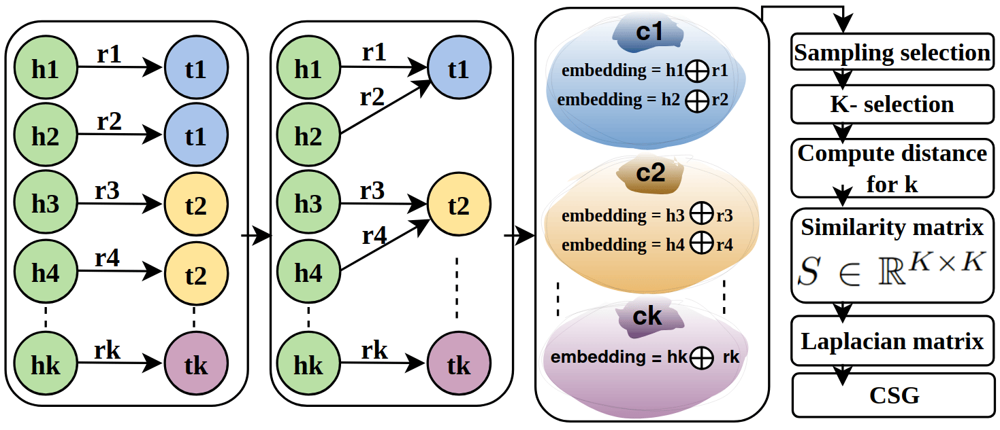
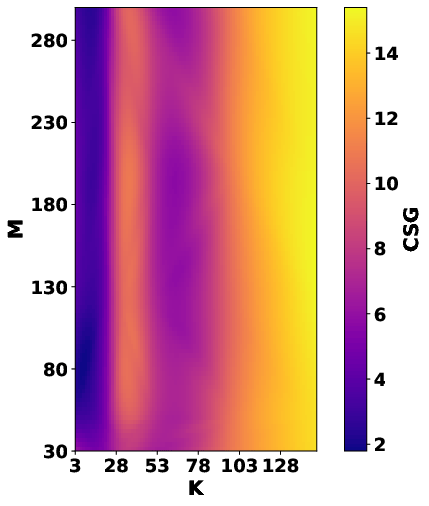
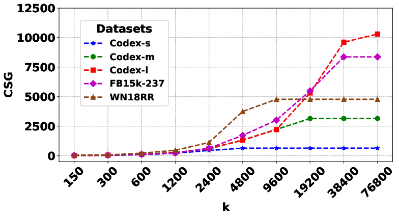
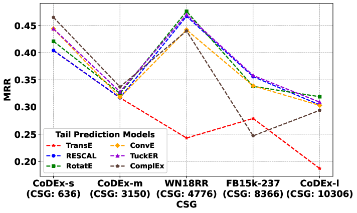

# Evaluating-Cumulative-Spectral-Gradient-as-a-Complexity-Measure

**Authors:** Haji Gul¹, Abdul Ghani Naim¹, Ajaz Ahmad Bhat¹  
¹School of Digital Science, Universiti Brunei Darussalam

**Paper:** [ MuSIML in ICML 2025](https://www.musiml.org/events/2025-ICML/accepted_papers.html)

---

##  Abstract

Accurate estimation of dataset complexity is crucial for evaluating and comparing link‐prediction models for knowledge graphs (KGs). The Cumulative Spectral Gradient (CSG) metric—derived from probabilistic divergence between classes within a spectral clustering framework— was proposed as a dataset complexity measure that (1) naturally scales with the number of classes and (2) correlates strongly with downstream classification performance. In this work, we rigorously assess CSG’s behavior on standard knowledge‐graph link‐prediction benchmarks—a multi‐class tail‐prediction task— using two key parameters governing its computation: $M$, the number of Monte Carlo–sampled points per class, and $K$, the number of nearest neighbors in the embedding space. Contrary to the original claims, we find that (1) CSG is highly sensitive to the choice of $K$, thereby does not inherently scale with the number of target classes, and (2) CSG values exhibit weak or no correlation with established performance metrics such as mean reciprocal rank (MRR). Through experiments on FB15k‐237, WN18RR, and other standard datasets, we demonstrate that CSG’s purported stability and generalization‐predictive power break down in link‐prediction settings. Our results highlight the need for more robust, classifier-agnostic complexity measures in  KG link-prediction evaluation.

**Contrary to the original claims**, we find that:
- CSG is highly sensitive to the choice of **K**, and does **not** inherently scale with the number of target classes.
- CSG values exhibit **weak or no correlation** with established performance metrics such as **Mean Reciprocal Rank (MRR)**.

Through extensive experiments on **FB15k-237**, **WN18RR**, CoDEx variants, and other standard datasets, we demonstrate that CSG’s purported stability and generalization-predictive power break down in link-prediction settings. Our results highlight the need for more robust, classifier-agnostic complexity measures in KG link-prediction evaluation.

---

## Key Figures

### Figure 1: Overview of the CSG Computation Pipeline
**Description:**  
Illustration of the proposed methodology. Triplets (head, relation, tail) are grouped by tail entities as classes. BERT embeddings are generated for head-relation pairs (concatenated), a similarity matrix **S** is constructed via k-NN search, the normalized graph Laplacian is computed, and the **Cumulative Spectral Gradient (CSG)** is derived from its eigenvalues.

*(See Fig-1 or the paper for the full diagram)*

Left box showing triplets where the heads are \((h_1, h_2, \ldots, h_k)\) (green), relations \((r_1, r_2, \ldots, r_k)\), and tails \((t_1, t_2, t_3)\) (in blue, yellow, and purple). The next box denotes the grouping of their tail entities into classes: \(c_1\) for \(t_1\), with \((h_1, r_1, t_1)\) and \((h_2, r_2, t_1)\) belonging to the same class, for example. BERT is used to embed head-relation pairs, producing 768-dimensional vectors, which are then concatenated (e.g., \(h_1 \oplus r_1\) and \(h_2 \oplus r_2\)) for each class \(c_i\). Next, a sampled \(k\)-nearest neighbor search is performed to compute distances and construct a similarity matrix \(S \in \mathbb{R}^{K \times K}\). The Laplacian matrix \(L\) is obtained from \(S\), and the spectral complexity of the KG is quantified using the Cumulative Spectral Gradient (CSG) calculated from its eigenvalues.

### Figure 2: CSG as a Surface Function of M and K (CoDEx-S Dataset)
**Description:**  
3D surface plot showing how CSG values change with varying Monte Carlo sample size **M** and nearest-neighbor parameter **K** on the CoDEx-S dataset. The plot demonstrates strong sensitivity to **K**, contradicting earlier claims of parameter stability.


CSG as a function of $M$ and $K$ values.


### Figure 3: CSG vs. K (Fixed M = 100)
**Description:**  
Line plot illustrating the strong influence of the nearest-neighbor parameter **K** on CSG values across multiple datasets (at M = 100). Larger **K** values generally lead to higher perceived complexity.


A plot of CSG as a function of $K$ values at $M = 100$.

### Figure 4: CSG vs. Model Performance (MRR)
**Description:**  
Scatter plot showing the relationship between CSG values and Mean Reciprocal Rank (MRR) achieved by various tail-prediction models across five standard KG benchmarks. The mean Pearson correlation is near zero (**R ≈ -0.644** in the paper), indicating that CSG does **not** reliably predict downstream link-prediction performance.


Relationship Between MRR from different tail-prediction models on five standard KG datasets and the corresponding CSG values.

---


## Repository Structure

```bash
csg-kg-complexity/
├── README.md
├── requirements.txt
├── src/
│   ├── __init__.py
│   ├── config.py
│   ├── data_loader.py
│   ├── embeddings.py
│   ├── similarity.py
│   ├── spectral.py
│   ├── utils.py
│   └── main.py
|   └── run_all_datasets.py
├── scripts/
│   └── run_all_datasets.py
├── data/                     # ← Place your KG datasets here 
├── results/                  # CSG output files


@inproceedings{gul2025csg,
  title={Evaluating Cumulative Spectral Gradient as a Complexity Measure for Knowledge Graph Link Prediction},
  author={Haji Gul and Abdul Ghani Naim and Ajaz Ahmad Bhat},
  booktitle={MusIML Workshop at ICML 2025},
  year={2025}
}
