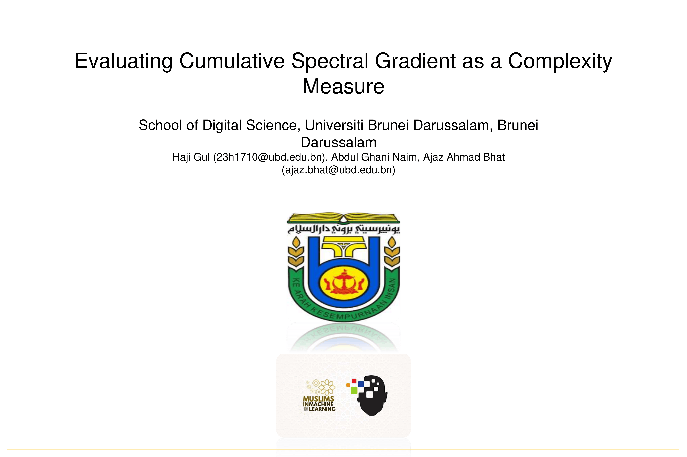
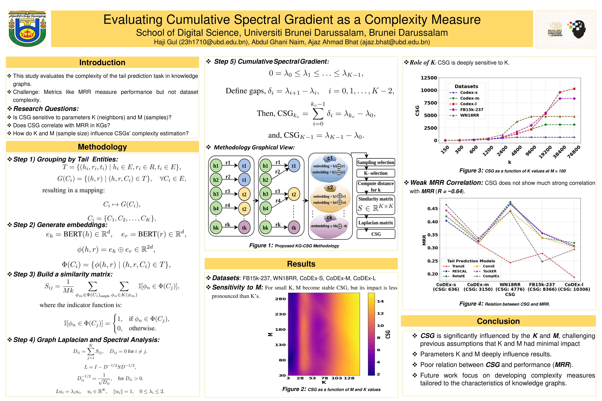

# Evaluating Cumulative Spectral Gradient as a Complexity Measure

**Authors:** Haji Gul, Abdul Ghani Naim, Ajaz Ahmad Bhat  
**Affiliation:** School of Digital Science, Universiti Brunei Darussalam  
**Workshop:** MuSIML at ICML 2025  

**Paper:** [ MuSIML in ICML 2025](https://www.musiml.org/events/2025-ICML/accepted_papers.html)

This repository contains the code, figures, and supporting material for our study on the **Cumulative Spectral Gradient (CSG)** as a dataset complexity measure for **knowledge graph (KG) link prediction**. In particular, we evaluate whether CSG is stable across parameter settings and whether it correlates with downstream model performance in multi-class tail-prediction tasks. 


## Datasets

The code expects datasets to be placed inside the data/ directory, with one subfolder per dataset. Each dataset folder should contain:

```bash
data/<dataset_name>/
├── train.txt
├── valid.txt
└── test.txt
```
Each file should contain KG triplets in plain text format, one triplet per line, for example:

```bash
head_entity    relation    tail_entity
```
Example:

```bash
BarackObama    bornIn      Hawaii
Paris          capitalOf   France
```

## Installation

Clone the repository and install the required Python packages:

```bash
git clone <your-repo-url>
cd E-CSG_Complexity_Measur-main
pip install -r requirements.txt
Requirements
```

The repository currently lists the following dependencies:

- torch
- transformers
- numpy
- scipy
- tqdm

Install them with:

```bash
pip install torch transformers numpy scipy tqdm
```

## How to Run
1. Prepare the dataset  
Place your dataset in the following format:

```bash
data/Nations/train.txt
data/Nations/valid.txt
data/Nations/test.txt
```
Replace Nations with the name of your dataset folder.

2. Run CSG computation for a single dataset  
From the project root, run:

```bash
python -m src.main --dataset Nations --base_dir data
```


Arguments
--dataset: name of the dataset folder inside data/
--base_dir: base directory containing the dataset folders

Example:
```bash
python -m src.main --dataset FB15k-237 --base_dir data
```
This will:

- load the dataset triplets
- group them by tail entity
- compute BERT embeddings for heads and relations
- build class-level vectors
- compute the similarity matrix
- compute the CSG score
- save the output to the results/ directory


3. Output

After a successful run, the result is saved as:
```bash
results/<dataset_name>_csg.txt
```

Example:
```bash
results/Nations_csg.txt
```

The output file contains:

```bash
Dataset: Nations
CSG Measure: 0.123456
```

4. Run multiple datasets

The repository also includes:

```bash
src/run_all_datasets.py
```
You can edit the dataset list inside that file and then run:

```bash
python src/run_all_datasets.py
```
This is useful when you want to compute CSG across several benchmarks in one pass.


---

## Overview

Estimating dataset complexity is important for understanding and comparing the difficulty of benchmark datasets used in knowledge graph link prediction. CSG was originally proposed as a complexity metric derived from spectral properties of class overlap, with the claim that it scales naturally with the number of classes and correlates with predictive performance. :contentReference[oaicite:2]{index=2}

In this work, we revisit those claims in the context of KG tail prediction. We compute class-wise representations from head-relation pairs, build a similarity matrix, derive a graph Laplacian, and then compute the **Cumulative Spectral Gradient (CSG)** from its eigenspectrum. Our experiments on standard KG datasets show that CSG is highly sensitive to parameter choices and does not reliably track model performance. :contentReference[oaicite:3]{index=3}

### Main findings

- **CSG is highly sensitive to the nearest-neighbor parameter `K`.**
- **CSG does not inherently scale with the number of target classes.**
- **CSG shows weak or no reliable correlation with downstream link-prediction performance such as MRR.**

These findings suggest that CSG is not a robust, classifier-agnostic complexity measure for KG link-prediction evaluation in its current form. :contentReference[oaicite:4]{index=4}

---

## Abstract

Accurate estimation of dataset complexity is crucial for evaluating and comparing link-prediction models for knowledge graphs. The Cumulative Spectral Gradient (CSG) metric was proposed as a dataset complexity measure derived from probabilistic divergence between classes within a spectral clustering framework. In this repository, we assess CSG on standard KG link-prediction benchmarks under a multi-class tail-prediction setting.

We study the role of two key computation parameters:

- **`M`**: the number of Monte Carlo sampled points per class
- **`K`**: the number of nearest neighbors in the embedding space

Our experiments show that CSG is strongly affected by the choice of `K`, contradicting prior claims of parameter stability. In addition, CSG values exhibit weak or inconsistent correlation with standard evaluation metrics such as **Mean Reciprocal Rank (MRR)**. We evaluate these behaviors on datasets including **FB15k-237**, **WN18RR**, and **CoDEx** variants, highlighting the need for more reliable complexity measures for KG link prediction. :contentReference[oaicite:5]{index=5}

---

## Method Summary

The pipeline implemented in this repository follows these main steps:

1. **Load triplets** from KG benchmark datasets.
2. **Group triplets by tail entity**, treating each tail as a class.
3. **Embed heads and relations** using BERT.
4. **Concatenate head and relation embeddings** to represent head-relation pairs.
5. **Aggregate vectors per tail class** to obtain class-level representations.
6. **Compute class overlap / similarity** between tail classes.
7. **Construct the graph Laplacian** from the similarity matrix.
8. **Compute the CSG score** from the Laplacian eigenvalues.

This lets us examine how the spectral complexity score behaves across datasets and parameter settings. :contentReference[oaicite:6]{index=6}

---


## Key Figures

### Figure 1: Overview of the CSG Computation Pipeline
**Description:**  
Illustration of the proposed methodology. Triplets (head, relation, tail) are grouped by tail entities as classes. BERT embeddings are generated for head-relation pairs (concatenated), a similarity matrix **S** is constructed via k-NN search, the normalized graph Laplacian is computed, and the **Cumulative Spectral Gradient (CSG)** is derived from its eigenvalues.

*(See Fig-1 or the paper for the full diagram)*

Left box showing triplets where the heads are \((h_1, h_2, \ldots, h_k)\) (green), relations \((r_1, r_2, \ldots, r_k)\), and tails \((t_1, t_2, t_3)\) (in blue, yellow, and purple). The next box denotes the grouping of their tail entities into classes: \(c_1\) for \(t_1\), with \((h_1, r_1, t_1)\) and \((h_2, r_2, t_1)\) belonging to the same class, for example. BERT is used to embed head-relation pairs, producing 768-dimensional vectors, which are then concatenated (e.g., \(h_1 \oplus r_1\) and \(h_2 \oplus r_2\)) for each class \(c_i\). Next, a sampled \(k\)-nearest neighbor search is performed to compute distances and construct a similarity matrix \(S \in \mathbb{R}^{K \times K}\). The Laplacian matrix \(L\) is obtained from \(S\), and the spectral complexity of the KG is quantified using the Cumulative Spectral Gradient (CSG) calculated from its eigenvalues.

### Figure 2: CSG as a Surface Function of M and K 
It shows how CSG values change with varying Monte Carlo sample size **M** and nearest-neighbor parameter **K** on the CoDEx-S dataset. The plot demonstrates strong sensitivity to **K**, contradicting earlier claims of parameter stability.

  

CSG as a function of $M$ and $K$ values.


### Figure 3: CSG vs. K (Fixed M = 100)
It illustrats the strong influence of the nearest-neighbor parameter **K** on CSG values across multiple datasets (at M = 100). Larger **K** values generally lead to higher perceived complexity.

  

A plot of CSG as a function of $K$ values at $M = 100$.

### Figure 4: CSG vs. Model Performance (MRR)
It shows the relationship between CSG values and Mean Reciprocal Rank (MRR) achieved by various tail-prediction models across five standard KG benchmarks. The mean Pearson correlation is near zero (**R ≈ -0.644** in the paper), indicating that CSG does **not** reliably predict downstream link-prediction performance.

  

Relationship Between MRR from different tail-prediction models on five standard KG datasets and the corresponding CSG values.


## Poster
  

  


## Notes
The current implementation uses BERT-based embeddings for heads and relations.  
Computation time may increase significantly for large datasets because embedding extraction and pairwise similarity computation can be expensive.  
Results are stored as plain-text files in the results/ folder for easy inspection and reproducibility.  


## How to Cite
If you use this repository, code, or findings in your work, please cite the corresponding paper:  

```bash
@inproceedings{gul2025csg,  
  title={Evaluating Cumulative Spectral Gradient as a Complexity Measure},  
  author={Haji Gul and Abdul Ghani Naim and Ajaz Ahmad Bhat},  
  booktitle={MusIML Workshop at ICML 2025},  
  year={2025}  
}
```


## Acknowledgment

This work was carried out at the School of Digital Science, Universiti Brunei Darussalam.
I can also turn this into a polished **final README.md file** for you.

